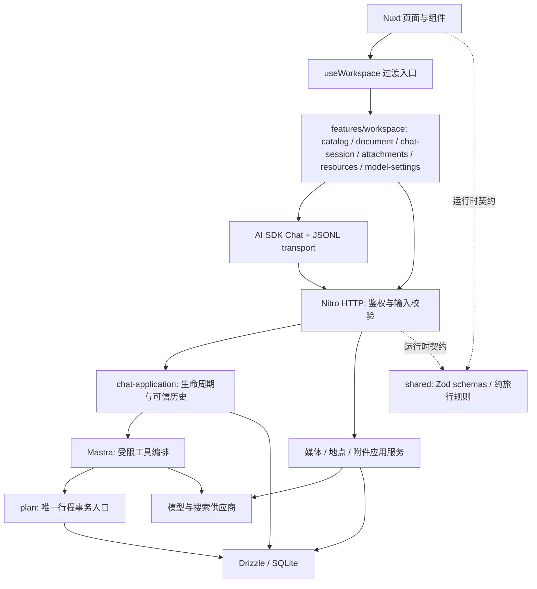

# 2026-09-18 渐进式架构与图文产品交付

2026-09-21 后续图片覆盖修复：[原因、腾讯云文搜图接入与配置](MEDIA_COVERAGE_FIX.md)。起点0f52c4c，修复名称匹配/消歧/Commons独立检索及旧缺图状态，并增加官方腾讯云SDK作为补充来源；283项测试与完整发布检查通过，免费图片8项真实验证通过，腾讯云真实联调因缺凭据未完成。以 [最新验证记录](VERIFICATION.md) 为准。

2026-09-21 补充修复：[联网、图片与落笔编排修复记录](SEARCH_PLANNING_FIX.md)。下表保留9月18日交付时的验证边界；当前已增加并实测 DeepSeek 官方 Anthropic 搜索，未配置 Tavily 也可以联网，详见 [供应商说明](PROVIDERS.md)。本次起点为包含鉴权修复的 `e9a982f`，保留该提交全部内容。

本轮保留 Nuxt 4、Bun、Better Auth、Mastra、AI SDK v5、Drizzle 与原 SQLite，采用模块化单体。起始 main/a404788，实施分支 codex/travel-delivery。目录、用户原有修改、首次运行证据见 [工程基线](ARCHITECTURE_BASELINE.md)。真实业务数据库和 .env 未迁移、覆盖或改写；全部数据验收在临时库完成。

变更分批保存在本地：`2f497dc` 基线/清理工具，`630699e` 取消竞态/扫描收敛，`ce0e526` 供应商/媒体/迁移，`0a8030b` JSONL与完整工作区，`c9b87da` 原创品牌，以及最终交付文档提交。未推送或部署。用户开始时的侧栏单行、auth/admin中间件、旧浏览器脚本和auth测试仍独立保留为未提交改动；品牌提交仅暂存自己的侧栏图标差异。

## 按产品要求核对

| 要求 | 已实现路径与验证边界 |
| --- | --- |
| 1 工程基线与清理 | 首次 lint/typecheck/build 成功；原213测试中31项 Windows Bun 子进程无法启动已修复。Knip 全量与生产分别运行，复核 Nuxt 模板/自动导入/Nitro/CLI/迁移/静态入口。删除确认无用途函数和仅测试旧包装，精确收敛内部导出。位置、证据、分类和退出条件见 [清理清单](CLEANUP_REPORT.md)。 |
| 2 成熟能力与依赖 | 沿用现有鉴权、ORM、校验、Agent 与聊天状态。直接声明已有 h3/vue/provider；增加版本对齐的 DeepSeek SDK、服务端 sharp 与开发期 Knip/unimport/OXC。没有升级 AI SDK/Mastra major；没有再写 ORM、Agent 循环、消息状态机。IndexedDB 保留现有已验证缓存策略，未引入 Dexie/idb/VueUse。兼容、维护、体积和迁移成本见 [基线依赖决策](ARCHITECTURE_BASELINE.md) 与 [供应商说明](PROVIDERS.md)。 |
| 3 模块与共享契约 | useWorkspace 保留过渡入口，内部导航/文档/聊天/附件/资源/设置分工；Nuxt 实例及用户隔离。HTTP 路由负责鉴权/校验，chat-application 负责运行，JSONL 适配独立，供应商独立。shared 集中消息、分页、预览、附件、资源、配置 Zod 契约。规划事务仍统一提交快照/revision/版本/预览。 |
| 4 JSONL | 请求单行消息记录、响应 application/x-ndjson 事件，版本/身份/序号明确；SDK parts、工具结果、来源与预览复用。UTF-8 跨块、半行/合行、非法数据、大小、超时、取消、重复和缺终态有回归测试；无模型输出格式冒充传输。幂等包括附件及实际配置。旧 SQLite 历史可读，旧 HTTP JSON 聊天入口已移除。见 [协议](JSONL.md)。 |
| 5 DeepSeek 搜索与思考 | 独立联网开关和四档思考，默认配置与本轮快照入库，能力不支持即禁用/拒绝。官方 DeepSeek 真实验证文字、图片、工具、low/high/max和工具回传；旧 chat 别名实际返回 flash，快照规范为真实模型。Responses 内置 web_search 被忽略，因此使用明确标注的 Tavily 独立工具，每轮3次、每次5来源、12秒。无 Tavily 凭据，真实搜索尚未联调。 |
| 6 图文行程、地点和地图 | 历史景点兼容稳定 ID；资源绑定用户/规划/实体/指纹/revision，异步结果不覆写后续编辑，不为每图建版本。Wikimedia 精确匹配并实际解码，保留出处/作者/许可；菜品明确标示意。百度城市/地点消歧，未知保持待定位。图文总览/预览、每日图、食记、城市切换/每日顺序图、缓存/懒加载/失败重试已接入。真实西湖/东坡肉图片已取得；百度缺凭据，地图与定位以隔离模拟验证。 |
| 7 多模态与恢复 | 选择/拖拽/粘贴/预览/移除/上传进度/重试，支持纯图。服务端真实解码和体积/像素/数量校验；附件 BLOB 独立存储、权限绑定、引用清理。模型边界才读取图片；历史和追问保留附件，预算超限/非视觉模型明确报错。菜单、攻略截图与景点识别仍经同一视觉输入和结构化编辑校验，不能把模拟测试视为识别质量评测。 |
| 8 品牌图标 | 原创山水行笺 SVG、透明512 PNG、16/32 favicon、ICO，登录页/侧栏/标签已接入，功能图标沿用 AppIcon。见 [品牌交付](BRAND.md)。 |
| 9 工程验收与文档 | 隔离迁移升级、单元/协议/数据库/浏览器/重启恢复验收，CI执行两种死代码扫描和图文产品流程。所有模拟供应商显式标注、使用随机临时库和虚构 key；不以测试图片或假搜索声称真实供应商可用。最终命令与结果见 [验证记录](VERIFICATION.md)。 |

## 模块职责与依赖方向

- `catalog` 拥有列表、游标和导航；`document` 拥有当前规划及版本；`chat-session` 包装 SDK 生命周期，SDK 是消息数组唯一所有者；`messages` 只将数据库 DTO 映射成 SDK parts。
- `attachments` 拥有输入框待发送文件和进度，服务器附件才是持久数据来源；`resources` 拥有派生图片/坐标加载状态，不参与编辑快照的版本同步。
- `shared` 不读取密钥、不依赖数据库或浏览器实例。服务端状态所有权由授权查询和事务保证；前端异步响应带实例/用户/工作区代际检查。
- 规划 `commitMutation` 仍是业务聚合，不因拆分引入多层 repository/interface/factory。HTTP 的保存、版本切换、AI 原子编辑均保留原有事务规则；取消信号在异步读取后、提交前再次检查。

## 升级、存量数据与回退

1. 使用现有一致性备份脚本创建新备份，并用 `db:restore:verify` 验证临时副本；备份必须包含所有业务表，附件也在同一 SQLite 中。
2. 按 bun.lock 安装（`bun install --frozen-lockfile`），配置 `.env.example` 中服务端变量。不要让旧服务与新迁移并发写入。
3. 部署维护窗口运行 `bun run db:migrate`，再启动新构建。0003 新增附件/资源/配置和消息parts/运行配置列；0004 增加多消息附件关联，0005 回填此前附件的 message_id。所有迁移保留历史，不删除用户规划、版本、消息、兼容表。
4. 历史景点缺 ID 时确定性读时补齐，已有 ID 保留，正常事务写入时持久化。旧消息缺 parts 仍按文本/工具/预览恢复。旧运行配置可空，用于历史读取；新轮配置必有实际快照。
5. 新旧聊天 HTTP 协议不兼容，前后端应一起部署并刷新旧页面。若回退程序，保留新增表/列通常可继续运行旧路径，但旧程序不会展示新附件/配置；需要数据级回退时仅恢复已验证备份到独立位置并明确切换，不能用 down/drop 删除新数据冒充安全回退。

`verify:media` 已在临时库验证旧0002数据→0003存量附件→0004/0005，包括消息引用回填及维护保留。未在真实业务库运行迁移。

## 外部服务与产品边界

- DeepSeek：已使用原 .env 进行9个小请求，8成功合计1435 tokens，1个“思考+强制工具选择”400；应用使用已验证的 auto 工具模式。未输出密钥或思考正文。实际证据详见 PROVIDERS。
- Wikimedia：无 key，真实取得并解码西湖实拍和东坡肉菜品图，署名/许可随资源显示。覆盖取决于精确百科条目，小众名称可能无匹配；会显示未找到，不猜网址或换成生成图。
- Tavily：需 `TAVILY_API_KEY`；百度需有地点检索、地理编码、静态图及全景权限的服务端 `BAIDU_MAP_AK`。本机没有这两项凭据，尚需真实联调，当前模拟不证明精度/可达性。
- 每轮最多4张附件，上下文最多12张（可配置更低），图像字节独立预算20 MiB；超限明确提示新建会话。恢复限于已提交文字、工具、附件和预览，不承诺断线期间未保存 token 的续传。
- 图片与位置派生资源不跟随历史版本快照回滚；历史预览不会套用当前版本资源。地图最多展示前10处已确认位置，顺序连线不是道路导航。
- 生产构建体积从基线22.1 MB/5.56 MB gzip增长到约42.6 MB/14.1 MB gzip，主要新增 sharp/libvips 服务端图像解码。未把这些服务端依赖打入浏览器；最终产物以构建日志为准。

使用步骤见 [用户手册](USER_MANUAL.md)，HTTP契约见 [API](API.md)，开发命令见 [DEV](DEV.md)。本轮不承诺无匹配图片的景点也能取得实图，也不把视觉红色探针等同于菜单/OCR或旅行事实准确率评测。
