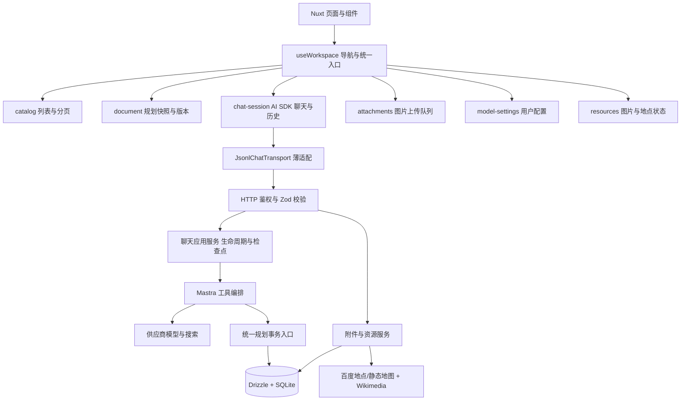

# 山海行笺技术交接

核对日期：2026-09-18。现行实现采用 Nuxt 4 + Bun + SQLite 的模块化单体，渐进整理内部职责，保留原有账号、规划、版本和会话数据。质量结果见 [验证记录](VERIFICATION.md)，操作见 [使用手册](USER_MANUAL.md)，部署见 [开发指南](DEV.md)，清理依据见 [清理报告](CLEANUP_REPORT.md)。

## 1. 状态与依赖方向

所有跨端契约集中在 shared/schemas：规划、消息、预览、分页、配置、附件、媒体和 JSONL。类型从 Zod Schema 推导；接口返回值在主要客户端边界再次解析。shared 不读取数据库、密钥或浏览器实例。

| 模块 | 状态所有者与职责 |
| --- | --- |
| app/composables/useWorkspace.ts | 按 Nuxt app 实例的 WeakMap 创建状态，统一导航、账号重置和公开操作 |
| app/features/workspace/catalog.ts | 工作区和会话列表、服务端搜索、分页游标、过期请求过滤、展开及排序 |
| app/features/workspace/document.ts | 当前规划、离线快照、版本分页、revision 前提、保存与切换后的对账 |
| app/features/workspace/chat-session.ts | 每个活动会话的 AI SDK Chat、请求身份、消息分页、取消、运行状态及完成刷新 |
| app/features/workspace/messages.ts | 已保存的旧字段及当前 SDK parts 到 UIMessage 的明确映射 |
| app/features/workspace/model-settings.ts | 账号默认设置、能力检查、串行保存和每轮不可变配置快照 |
| app/features/workspace/attachments.ts | 按对话草稿划分的 File、Object URL、XHR 上传进度、移除与重试 |
| app/features/workspace/resources.ts | 独立资源状态，稳定实体 ID + revision，批次队列、并发上限及过期响应隔离 |

AI SDK 是消息集合和生成状态的唯一所有者，没有第二套消息数组或 Agent 循环。导航计数、请求序号和生命周期标记使旧响应无法覆盖新工作区；退出或换用户会清理 Chat、配置、附件 Object URL 与媒体状态。useCurrentUser 在 SSR 使用 useRequestFetch 转发当前请求 Cookie。保留既有按用户隔离的 IndexedDB 缓存。

## 2. HTTP、聊天和持久化

POST /api/chat 接受单条或规定范围内的 JSONL 记录，响应为 application/x-ndjson。浏览器不用持续双向上传流。版本、requestId、messageId、事件序号、终态、大小限制和流解析规则见 [JSONL 协议](JSONL.md)。

JsonlChatTransport 把最新 SDK 用户消息转换为 JSONL 请求，把服务端事件转换为当前 AI SDK v5 可以解析的消息流；UTF-8、半行、重复与缺失终态在协议层处理。修改的是实际传输，不是只更改 Content-Type，也不要求模型逐行输出 JSON。DeepSeek 和 Mastra 继续使用各自上游协议。

HTTP 路由负责请求边界；server/services/chat-application.ts 负责运行生命周期，chat-runs 持久化幂等身份与状态，chat-jsonl 负责下行适配。上下文从授权数据库历史取得，按文字和图片预算整理；客户端旧 system、工具记录不能取得额外权限。

请求身份包含规范化文字、附件标识、实际模型及联网／思考配置。同请求重发不会再次执行工具，明确新一轮重试才生成新 ID。终止、超时或进程重启后恢复已提交内容及检查点，不承诺重放尚未保存的 token。

SQLite 保存消息、parts、附件引用、配置快照和运行状态；旧文本／工具列仍可恢复。二进制不写入普通聊天文本、JSONL 日志或行程 JSON。消息、版本和列表使用有作用域游标分页，首批默认 50 条。

## 3. 规划事务与兼容升级

server/services/plan.ts 仍是统一写入入口。规划快照、current_version_id、单调 revision、版本记录和关联消息／预览在原有事务规则中提交。重构没有把一次事务拆成多个异步 repository 调用。

- 客户端写入携带 expectedVersion 与 expectedRevision，旧快照返回 409。
- 一轮 AI 以 assistantMessageId 识别；该轮版本仍为当前时继续更新，指针移动或换轮后追加。
- 切换版本移动指针，revision 递增；不新建或删除历史版本。
- AI 只能调用校验后的原子编辑或兜底 patch，不能用文字全量覆盖行程。
- 手工编辑草稿按账号、规划、对象保留；冲突先比较最新内容，再由用户重新应用。

景点增加稳定 ID。历史读取／写入通过 ensurePlanEntityIds 补齐；已有 ID 保持，缺失 ID 可按城市、名称、地址的唯一旧匹配继承。新实体分配稳定 ID，重复地点消除碰撞。资源键使用 spot:ID、food:ID 和城市身份，补图不能用当前数组下标写回。

所有数据库变化走 Drizzle 迁移，在临时数据库验证历史升级。历史 migrations 与兼容 panoramas 表仍保留；新影像进入 cache，旧表退出条件与死代码判定见清理报告。真实业务数据库不得用于集成测试或覆盖恢复。

## 4. DeepSeek 与外部能力

server/providers/models.ts 按官方能力和实际探针建立模型配置。当前实现使用直接声明的 DeepSeek SDK，并保持现有 AI SDK / Mastra major。服务器规范化已验证的旧模型别名，把实际模型写进请求身份。

DeepSeek 支持的四档对应关闭 thinking，以及启用 thinking 后的 low／high／max；不支持的档位前后端都拒绝。兼容网关必须显式配置并验证，不能仅凭模型名称推断视觉能力。每个部署仍应根据 [验证记录](VERIFICATION.md) 核实所选模型与服务。

联网是独立 Tavily 搜索工具。DeepSeek 的兼容接口不会因传 web_search 就被当作原生搜索；UI 和来源明确标注实际提供方。关闭联网不注册／执行搜索路径；开启后由模型按需调用，限制次数、超时与内容规模。来源作为外部资料处理，不改变系统规则或工具权限。

供应商密钥只在服务端读取。百度 AK 保持仅由 server/services/baidu.ts 访问；前端通过静态图、街景和资源代理使用服务。完整变量见 .env.example 与开发指南。

## 5. 图片、地点与多模态

附件由独立 multipart 接口上传。Sharp 实际解码 JPEG／PNG／WebP，检查数量、字节、像素与尺寸，重编码剥离元数据。附件属于用户和规划；读取、模型解析和消息绑定都校验作用域。附件和消息引用在事务内绑定；已发送引用不能作为普通未发附件删除。未关联超过 24 小时的上传有清理规则。

向模型提交前才把授权附件解析为供应商要求的图片 parts。当前图片、数据库历史与后续追问共享附件引用。不支持视觉时明确失败，不丢弃图片。浏览器 XHR 用于标准上传进度，File API 处理选择／拖拽／粘贴；没有新增自制文件协议或状态框架。

资源服务按实体身份与内容指纹关联。Wikimedia 图片须取得匹配的来源、署名和真实可解码文件后才标记可用；美食图明确为菜品示意。百度按城市、名称、地址定位，无法消歧时保持待定位。资源代理有用户／规划授权。

前端批次每次最多取 12 个待补实体、同一规划最多 2 个并行请求，然后继续下一批。已失败或已尝试但仍 pending 的资源不会无限自动重试；HTTP 异常停止批次，用户可显式重试。注销、跨修订响应或旧任务不得回写新状态。

资源状态独立保存，不改变行程版本。地图优先使用可信资源坐标，或用户行程内已有坐标；CityMap 支持多城市、每日顺序标记，旧 MapView 保留每日编辑与分页。地图连线是示意，不是道路导航。图片复用懒加载、IndexedDB 和服务端缓存。

## 6. 依赖、品牌和验证

保留 Better Auth、Drizzle、Zod、Mastra、AI SDK、Nuxt/H3 的既有职责。选择与迁移成本见 [交付报告](DELIVERY.md)；新依赖必须在 package.json 直接声明并进入 Bun 锁文件。浏览器文件交互复用平台能力，未为短小函数额外引入 UI 库、VueUse 或第二套缓存系统。

品牌图标为可编辑原创 SVG，PNG 和 ICO 用已有 Playwright Chromium 渲染，没有新增品牌运行依赖。BrandMark 与功能 AppIcon 分离，已接登录页、侧栏及页面 head。资产、尺寸和小图检查见 [品牌文档](BRAND.md)。

代码质量入口是 bun run check，包含 lint、类型、测试与死代码检查；生产构建、隔离数据库 HTTP、重启恢复及浏览器产品验收由 package.json 的相应脚本执行。Knip 使用 Nuxt 真实生成入口、组件模板引用、服务端动态入口以及分开的生产／测试扫描，不把全部源码伪装入口。

真实服务联调与可复现模拟必须区分。缺少搜索或地图凭据时，模拟验证证明本地行为，不代表外部服务成功；外部网络、额度、图片匹配或地图权限失败应如实展示。最终逐项覆盖、实际命令和限制见 [交付报告](DELIVERY.md) 与 [验证记录](VERIFICATION.md)。
