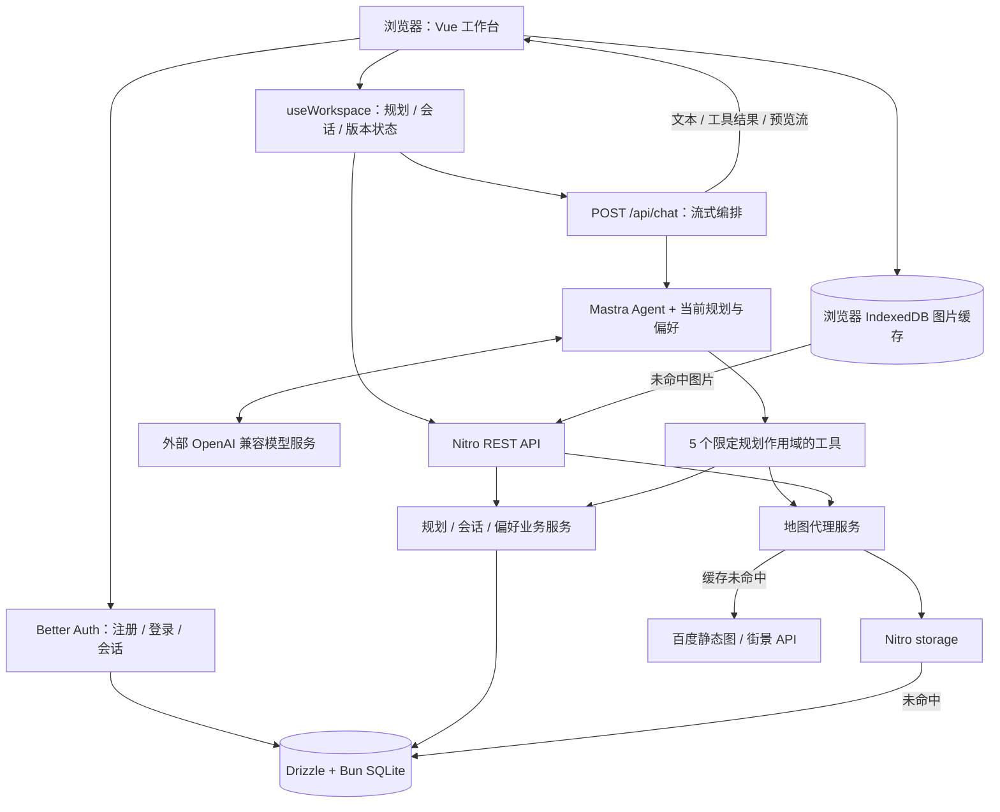
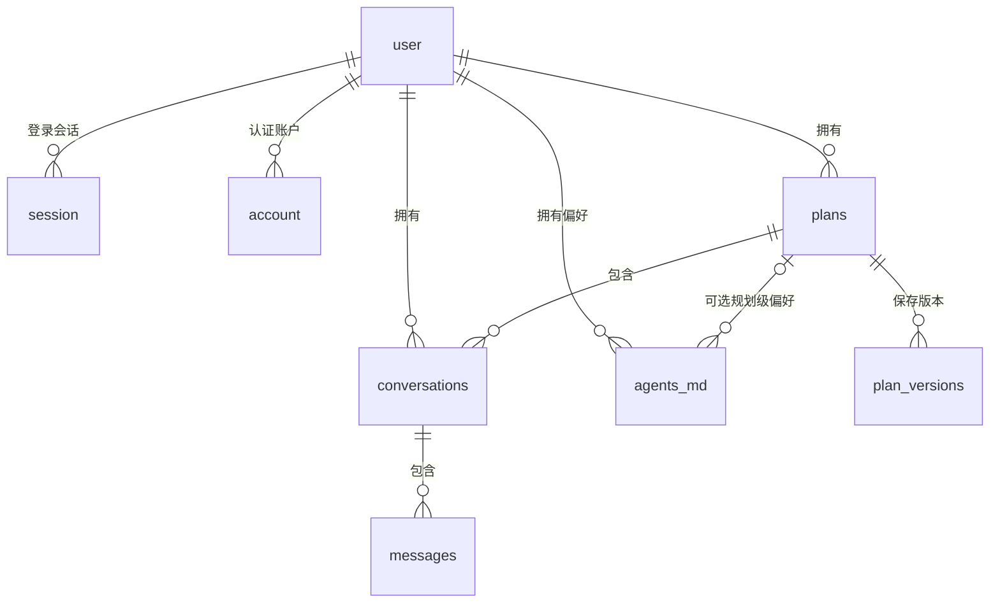
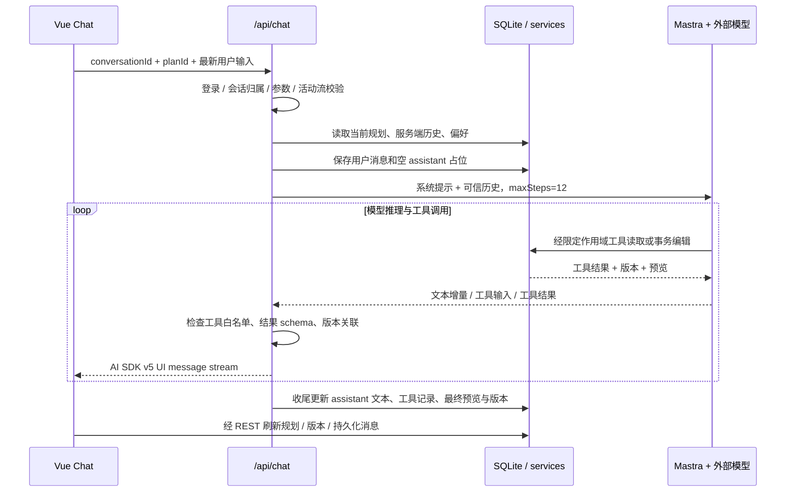

# 山海行笺：技术实现与开发者交接手册

本文依据当前仓库源码编写，核对日期为 2026-09-16。面向需要理解架构、继续开发、排查问题与部署项目的开发者。用户操作见 [使用手册](USER_MANUAL.md)，本次实际运行结果见 [验证记录](VERIFICATION.md)。[PRD](PRD.md) 描述产品目标；本手册特别标出源码与目标之间的差异。

## 1. 项目解决什么问题

项目界面与包名使用「山海行笺 / shanhai-xingjian」，当前文件夹名为 `moji-xinglv-main`。它是一个带账号体系的 AI 旅行规划工作台：用户为一次旅行创建工作区，通过对话或表单维护每日行程、景点、预算、美食手账和出行清单；修改结果保存到数据库，可查看差异、切换历史版本。

核心模型是 **一个工作区就是一份规划，一个规划下可以有多个会话**。这些会话共同操作该规划的当前内容；新建会话不会自动复制行程。界面为左侧工作区树加主内容区，主区在对话、版本路线、规划编辑与设置间切换。

AI 的价值是把自然语言需求转成受约束的数据修改。项目调用外部语言模型，没有自训模型、向量数据库、知识库检索或 RAG 管线。`search_poi` 只查询当前规划里已有坐标的景点；没有实时联网搜索、在线地理编码、道路导航、酒店机票预订或跨用户共同编辑。

## 2. 实际技术栈与版本

下表版本取自当前 [package.json](../package.json) 和 [bun.lock](../bun.lock)，不是对上游最新版本的判断。`^` 是允许升级的依赖范围；锁文件记录本仓库解析结果。复现时应使用 `bun install --frozen-lockfile`。

| 层次 | 技术 | 声明 / 当前锁定 | 在项目中的职责 |
| --- | --- | --- | --- |
| 运行时与包管理 | Bun | `engines.bun >=1.4.0` | 启动 Nuxt、执行脚本、提供 `bun:sqlite` |
| 全栈框架 | Nuxt | `^4.5.2` / `4.5.2` | Vue 页面、SSR、Nitro 服务端、文件路由 |
| 视图层 | Vue | 随 Nuxt 依赖引入 / `3.5.42` | Composition API、单文件组件、响应式状态 |
| 类型 | TypeScript | `^5.9.0` / `5.9.3` | 前后端共享类型，strict 模式，独立类型检查 |
| AI Agent | `@mastra/core` | `^1.66.0` / `1.66.0` | 按请求创建 Agent、注册工具、多步调用 |
| 流协议适配 | `@mastra/ai-sdk` | `^1.10.2` / `1.10.2` | `handleChatStream` 输出 AI SDK v5 消息流 |
| 流式聊天 | `ai`、`@ai-sdk/vue` | 精确固定 `5.0.257`、`2.0.257` | 服务端流式响应、客户端 `Chat` 与 transport |
| 数据库 | SQLite、Drizzle ORM | Bun 内置 SQLite；ORM `^0.45.2` / `0.45.2` | 持久化规划、版本、消息、账号与缓存 |
| 数据迁移 | drizzle-kit | `^0.31.10` / `0.31.10` | 从 schema 生成 SQL migration |
| 身份认证 | Better Auth | `^1.7.4` / `1.7.4` | 邮箱密码、会话、Drizzle adapter、admin 插件 |
| 校验 | Zod | `^4.6.5` / `4.6.5` | 行程契约、API 与工具参数、部分环境配置 |
| Markdown | `md-editor-v3`、`@nuxtjs/mdc` | `^6.5.6` / `6.5.6`；`^0.23.1` / `0.23.1` | 编辑器、Markdown 渲染 |
| 样式 | Sass / SCSS | `^1.104.1` / `1.104.1` | 宣纸、墨色、朱砂等设计令牌与手写组件 |
| 浏览器缓存 | IndexedDB、localStorage | 浏览器 API | 图片 Blob 的 TTL/LRU 缓存、界面展开与排序偏好 |
| 服务端缓存 | Nitro storage、SQLite `cache` | 框架能力 / 项目实现 | 内存/本地缓存接口与图片持久化缓存 |
| 地图影像 | 百度静态图与全景静态图 | 外部 HTTP API | 服务端代理获取地图、街景图片 |
| 质量检查 | ESLint、Vitest、vue-tsc | ESLint `9.39.5`；Vitest `4.1.11`；vue-tsc 声明 `^3.3.11` | 风格检查、单元与隔离后端测试、类型检查 |

没有引入通用 UI 组件库或 Pinia。工作区状态由自定义 composable 管理。PRD 提到的 Mastra Memory/Workflow、Prettier 等不能据此视为已接入；当前核心链路是 Agent + tools + 自建消息持久化，代码检查脚本使用 ESLint。

两个配置应保留：Nuxt 命令使用 `bun --bun`，否则 `bun:sqlite` 无法在普通 Node 运行时工作；[nuxt.config.ts](../nuxt.config.ts) 中 `vite.ssr.noExternal: ['zod']` 用于处理仓库已记录的 SSR 导出兼容问题。AI SDK 的 major 升级需要连同 Mastra 适配层验证完整聊天链路。

## 3. 整体架构与代码入口



这是一个同仓库、同运行时的全栈应用。服务端 REST、AI 编排、缓存和数据库操作都在 Nuxt/Nitro 服务内，没有独立 Python 服务或另外部署的 Agent 服务。

| 目录 / 文件 | 阅读重点 |
| --- | --- |
| [app/pages](../app/pages) | `/` 工作台、`/login` 登录注册、`/admin` 后台 |
| [WorkspaceSidebar.vue](../app/components/WorkspaceSidebar.vue)、[MainPanel.vue](../app/components/MainPanel.vue) | 工作区树、主区模式切换 |
| [PlanWorkspaceView.vue](../app/components/PlanWorkspaceView.vue) | 规划编辑主界面，联接行程、地图、食记、街景、偏好 |
| [useWorkspace.ts](../app/composables/useWorkspace.ts) | REST 加载、Chat 生命周期、保存、版本切换、会话恢复 |
| [app/utils/api.ts](../app/utils/api.ts) | 前端接口封装与错误文案 |
| [server/api](../server/api) | HTTP 鉴权、参数校验、调用业务服务；完整路由见 [API 文档](API.md) |
| [server/services/plan.ts](../server/services/plan.ts) | 规划事务、版本提交、差异、乐观锁、切换历史 |
| [server/api/chat.post.ts](../server/api/chat.post.ts) | 对话信任边界、流式收集与持久化、取消与超时 |
| [server/agents](../server/agents) | Agent 系统提示、模型配置、工具与名称白名单 |
| [shared/schemas/plan.ts](../shared/schemas/plan.ts) | 行程 JSON 与 TypeScript 类型的唯一来源 |
| [shared/utils](../shared/utils) | 原子编辑、Merge Patch、差异、版本树、路线参数、稳定哈希 |
| [server/database](../server/database) | 业务/鉴权 schema、迁移、种子数据 |

`useWorkspace` 用 `WeakMap` 按 Nuxt app 实例保存状态，避免把不可序列化的 Chat 对象放入 SSR 共享模块单例。它还用导航计数、请求序号和生命周期标记忽略过期响应，防止快速切换工作区后旧请求覆盖新界面。localStorage 存的是侧栏展开和排序设置，不能据此推断行程已经离线保存。

## 4. 数据模型与数据库关系

数据库初始化见 [server/utils/db.ts](../server/utils/db.ts)：根据 `DATABASE_URL` 解析本地文件路径，创建一个 `bun:sqlite` 连接，启用 WAL 和外键。业务写入统一经过这一 Drizzle 实例，Better Auth 也通过其 adapter 使用它；Mastra 没有配置独立 SQLite 存储。



图中展示实际外键关系。`verification` 存认证验证数据；`cache` 和旧 `panoramas` 是独立表。以下版本指针属于应用维护的逻辑关系，并非 schema 中都声明了外键。

| 表 | 主要用途与关键字段 |
| --- | --- |
| `user`、`session`、`account`、`verification` | Better Auth 表；角色/封禁信息在 `user`，密码哈希在 credential `account` 中 |
| `plans` | 拥有者、标题/摘要/封面、当前 `plan_json`、额外 Markdown `content_md`、`current_version_id` |
| `plan_versions` | 完整行程快照、规划内版本号、父版本 ID、来源、diff、关联 assistant 消息 ID |
| `conversations` | 绑定用户与规划；`plan_id` 必填，没有未分组会话 |
| `messages` | 角色、文本、工具调用 JSON、预览 JSON、版本 ID、时间 |
| `agents_md` | 用户级或规划级偏好；保存当前内容和递增版本数字 |
| `cache` | `key`、二进制值、类型、过期时间；当前地图图片的持久化落点 |
| `panoramas` | 旧街景表仍保留；当前影像服务不会把新图写入这里 |

`plans.current_version_id → plan_versions.id`、`plan_versions.parent_version_id → plan_versions.id`、`plan_versions.message_id → messages.id`、`messages.plan_version_id → plan_versions.id` 由服务层维持。`plan_versions(plan_id, version)` 有唯一索引。同一用户/规划的偏好有组合唯一索引，但 SQLite 的 `NULL` 唯一语义不能单独保证用户级 `plan_id=NULL` 只出现一行；当前保存逻辑依赖事务内先查再更新/插入。

删除规划会通过外键级联删除其版本、会话及规划级偏好，会话再级联删除消息。这里的「历史保留」指版本切换不删除历史，并不意味着删除规划后仍可恢复。鉴权表定义来自 [auth-schema.ts](../server/database/auth-schema.ts)，业务表见 [schema.ts](../server/database/schema.ts)，修改表结构应生成新的迁移，不直接改已应用的 migration。

## 5. 行程契约与编辑方法

[PlanSchema](../shared/schemas/plan.ts) 使用 Zod strict object：行程、天、景点、预算、食记、清单都拒绝未知字段。旧数据缺少新字段时由 schema 默认值补全。

| 字段 | 含义与主要约束 |
| --- | --- |
| `title`、`summary`、`cover` | 行程名称、摘要、封面 |
| `days[]` | 最多 90 天；日期、城市、景点、交通 `transport`、住宿 `lodging`、用餐 `meals` |
| `days[].spots[]` | 每天最多 50 个景点；名称、BD09 坐标、时段、地址、类别、停留分钟数、花费、图片与备注 |
| `budget` | 总预算、三位大写币种、可选分类金额；不是支付或财务记账系统 |
| `tips`、`tags` | 行程提示和标签 |
| `foodJournal[]` | 最多 300 条；`wishlist/tasted` 状态、餐厅、餐次、花费、整数评分 0–5 |
| `checklist[]` | 最多 100 条；`id`、文字、完成状态 |

食记和清单各自要求 ID 唯一。景点未知坐标必须 `lng`、`lat` 同时为空，不能只提供其中一个，也不能把未知位置填成 `(0,0)`。图片字段允许空值、HTTPS URL 或本站地图代理路径。日期目前是限长字符串，没有完整日历合法性或行程连续性校验。

用户可视化表单最终通过 REST 保存合法的 `Plan`；AI 只能使用以下结构化方式修改，不能直接用聊天文本覆盖数据库。

1. **原子操作 `apply_plan_edits`**：一次 1–30 项，面向 `plan/day/spot/food/checklist`，支持具体目标允许的增删改、移动、状态和勾选操作。服务端在同一事务内按顺序执行，最后重新解析完整 Plan，任一步失败则不提交这批操作。
2. **兜底 `patch_plan_json`**：采用 RFC 7396 风格的 Merge Patch：对象递归合并、数组整体替换、`null` 删除字段。它不是 RFC 6902 的 `op/path/value` JSON Patch。合并后仍须通过 PlanSchema；必填字段不能随意删除，带默认值的字段可能被 schema 补回。

例如，已有第 1 天时，可让工具增加一个没有可靠坐标的景点，再加入清单：

```json
{
  "planId": 1,
  "expectedVersion": 3,
  "edits": [
    { "target": "spot", "action": "add", "day": 0,
      "value": { "name": "待确认景点", "lng": null, "lat": null, "notes": "坐标待补全" } },
    { "target": "checklist", "action": "add", "text": "核实景点开放时间" }
  ]
}
```

这里 `planId` 和版本号只是示例，应由当前工作区提供；`day` 是从 0 开始的数组索引。原子语义见 [plan-edits.ts](../shared/utils/plan-edits.ts)，Merge Patch 的原型属性拒绝、节点数与深度限制见 [merge-patch.ts](../shared/utils/merge-patch.ts)。未知字段错误会返回路径和修正提示，如住宿应使用 `lodging`，不是 `stay`。

## 6. AI 工具与流式数据流

### 6.1 模型和上下文

[travel-agent.ts](../server/agents/travel-agent.ts) 每次请求创建一个 `travel-agent`。配置 `AI_BASE_URL` 时使用自定义兼容端点；不配置时走 `openai/模型名` 路径。默认模型名为 `deepseek-chat`，因此切换提供方时需同时检查 base URL、模型名和密钥，不能只更换一个变量。

系统提示包含当前用户称呼、规划 ID、当前版本、**完整当前 Plan JSON**、生效偏好和工具规则。AI 是以当前结构化规划为上下文的工具调用系统，没有后台持续自主运行的 Agent。

| 工具 | 实际职责 | 数据影响 |
| --- | --- | --- |
| `get_plan` | 重读当前规划快照与版本 | 只读 |
| `apply_plan_edits` | 对当前规划执行原子操作批次 | 追加或复用本轮 AI 版本 |
| `patch_plan_json` | 原子操作无法表达时提交 Merge Patch | 经 `patchPlan` 追加版本 |
| `get_panorama` | 用已知 BD09 坐标获取并预热街景代理图 | 写影像缓存；不自动把 URL 写回景点 |
| `search_poi` | 在当前规划已有、已定位景点中按文字/城市筛选 | 只读，无外部搜索 |

每个工具都接收 `planId`，`ensureScope` 校验它等于本轮工作区，并检查终止信号；数据库读取还会核实 `userId` 归属。`get_panorama` 返回代理 URL 后，需要另外调用编辑工具写入 `spot.panorama`。

### 6.2 从用户输入到持久化



客户端历史不直接作为模型的可信历史。服务端只使用数据库已有的 user/assistant 文字，加上本次最后一条用户文字；客户端伪造的历史 system 或工具输出不会因此获得工具权限。见 [shared/schemas/chat.ts](../shared/schemas/chat.ts)。

消息加载和模型上下文有明确窗口：`listMessages` 默认读取最近 **200 条**；其中非空 user/assistant 历史最多取 **60 条**，每条文字截断到 20,000 字符，再按需追加当前输入，因此模型收到的消息可能是 61 条。系统通知、旧工具调用结构不作为历史工具结果重新送入模型。更早消息可能仍在数据库中，但当前界面未实现加载更早消息的分页入口。

协议入口使用 `handleChatStream({ version: 'v5' })` 和 `createUIMessageStreamResponse`。客户端使用 `@ai-sdk/vue` 的 `Chat`、`DefaultChatTransport`；数据库消息恢复使用仓库自己的 `toWorkbenchMessages`。当前源码没有调用 PRD/AGENTS 文档中提及的 `toAISdkV5Messages`，不应把它当作现行恢复链路。

### 6.3 取消、失败与保存边界

单次聊天最多 12 个 Agent 步骤，服务端 180 秒截止时间，累计回复文字超过 100,000 字符会中止。同一服务进程用 `activePlans` 阻止同一规划同时开两条 AI 流；它不是跨实例分布式锁。

每次工具编辑一旦事务成功就已经写入数据库。点击停止、模型失败或浏览器断开不会撤销已成功的编辑。正常结束、取消或错误时会尝试把累计文字、工具调用和最后预览写回 assistant 消息，并解除活动标记。规划事务与最终消息写入不是同一事务；不能保证进程异常退出时占位消息、文字和规划版本始终同步完整。

工具结果中的预览、规划 ID、版本号与版本行会再次校验后才交给前端。用户看到的预览是摘要结构，完整行程仍以数据库版本为准。较早工具预览还可能记录同轮编辑的中间状态，应通过对应版本读取最终内容。

工具入参契约集中在 [tool-inputs.ts](../server/agents/tool-inputs.ts)，由工具定义和聊天流边界共同使用。Mastra 的入参验证失败可能作为普通 `tool-output-available` 返回；聊天入口先重验本地输入，把这类结果转换成可读错误，不直接展示框架附带原始参数的 message。

工具业务错误由 [errors.ts](../server/utils/errors.ts) 标记为应用自己的错误类。`handleChatStream.onError` 沿 Mastra 包装异常的 cause 链保留这类提示，未知错误仍隐藏。不能在适配层无条件返回固定文案，否则字段校验等可操作信息会在界面处理之前丢失。回归测试 [tool-sdk-integration.test.ts](../tests/tool-sdk-integration.test.ts) 使用真实 Agent、工具和 SDK 适配层，只模拟模型与业务 I/O。

## 7. 版本、事务和并发控制

实现集中在 [plan.ts](../server/services/plan.ts)。修改事务使用 SQLite `behavior: 'immediate'`，回调内同步 `.get()` / `.run()`，把读取、版本比较、编辑、校验、版本行和当前快照更新包在一起。

| 操作 | 当前实际行为 |
| --- | --- |
| 新建规划 | 写 `plans`，创建 v1，设置当前版本指针 |
| 手工保存且内容变化 | `savePlanVersion → commitVersion`，追加 `max(version)+1` |
| 手工保存无变化 | 仍先检查预期版本，返回 `skipped: true`，不追加版本 |
| 修改标题、预算等 JSON 内元数据 | 内容变化才创建 user 版本，并同步 `plans` 的展示字段 |
| 只修改 Markdown `contentMd` | 更新 `plans.content_md`；它不在 Plan JSON 和版本快照内 |
| AI 原子编辑 | `applyPlanEdits → commitAiTurn`；同 assistant 消息且该 AI 版本仍为当前时，原地更新该版本 |
| AI 兜底 patch | `patchPlan → commitVersion`；不经过 `commitAiTurn`，每次调用都会追加，当前也没有无变化跳过逻辑 |
| 切换到历史版本 | 不新增版本行；移动指针，并同步 `plans.plan_json`、标题、摘要和封面为目标快照 |

因此，**“同一轮 AI 对话只有一个版本”只适用于原子编辑的复用路径，版本快照也不是严格不可变的**。同轮第二次 `apply_plan_edits` 可以更新第一次写入的版本内容；如果当前指针被移走、换了 assistant 消息或使用了 patch 兜底，可能追加版本。版本复用判断在工具之间混用时也以服务层实际查询结果为准，不应只按界面的一轮对话计数。

新增版本号取该规划的最大历史版本号加 1，父版本取当前选中版本。例如已有 v1→v2→v3，切回 v1 后再编辑得到 v4，且 v4 的父版本是 v1；v2/v3 仍保留。[version-tree.ts](../shared/utils/version-tree.ts) 和 [VersionRoadmap.vue](../app/components/VersionRoadmap.vue) 负责组织与显示这类分支。

`diff_json` 是 `{path, before, after, kind}` 列表，见 [diff.ts](../shared/utils/diff.ts)。等长数组按索引递归比较，数组长度变化会记录整个数组变化；它不是面向景点 ID 的语义 diff。原子编辑复用版本时，diff 尽量以该版本父快照为基准重新计算。

### 7.1 expectedVersion 的保护范围

保存、元数据修改、版本切换与 AI 编辑支持 `expectedVersion`。它比较的是**当前版本号**，不是最大历史版本号，也不是版本行 ID。不同则返回 409。应用客户端应发送它；目前 API 和工具 schema 都将其设为可选，省略时不会执行这项比较。

这个 CAS 式检查有边界：

- 同轮原子编辑可把 v5 的内容原地改成另一个内容但仍叫 v5；持有旧 v5 草稿的客户端也发送 `expectedVersion: 5`，比较仍通过，无法检测所有并发变化。
- 指针 v1→v2→v1 的往返也不会留下单独的递增修订号；只比较当前版本号不能覆盖这种变化。
- SQLite 事务保证单次提交内部一致，但不等于多设备或多实例协作编辑已实现。

若后续需要严格检测陈旧写入，可另加每次写入都递增的 `revision`，将其纳入事务比较；这是待开发方向，不是当前已有能力。

### 7.2 不属于版本快照的内容

规划额外 Markdown、偏好设置、会话文字和缓存都不是 Plan JSON 的一部分。切换行程历史不会恢复这些数据。保存/切换 API 中的系统消息在版本事务成功后单独插入；消息插入失败不会回滚已经成功的版本操作。见 [save.post.ts](../server/api/plans/[id]/save.post.ts) 与 [switch.post.ts](../server/api/plans/[id]/switch.post.ts)。

## 8. 地图与缓存

### 8.1 影像链路

百度 AK 只由 [server/services/baidu.ts](../server/services/baidu.ts) 读取。服务只允许 `staticimage/v2` 与 `panorama/v2` 两个固定接口，不把任意用户 URL 透传给百度，不加载浏览器百度 JS 地图 SDK。

路线图使用 BD09 坐标，按当前页景点顺序绘制 markers/paths 连线；每页最多 10 个地点。[MapView.vue](../app/components/MapView.vue) 提供放大、缩小和地点聚焦按钮，通过改变参数重新请求静态图，不支持自由拖动。[routes.ts](../shared/utils/routes.ts) 用 Haversine 公式累加当天相邻且都有坐标的地点之间的直线距离，供行程密度参考；未知坐标会使估算不完整。这里没有道路路线计算、道路里程或导航预计耗时。街景也是图片，并非可自由移动的全景播放器。

请求图片时的主要命中顺序：

1. [CachedImage.vue](../app/components/CachedImage.vue) 经 [idb.ts](../app/utils/idb.ts) 获取浏览器 IndexedDB Blob。
2. 未命中则访问本站已登录的图片 API；浏览器 HTTP 缓存也可能参与命中。
3. 后端先查 Nitro storage，再查 SQLite `cache`。
4. 都未命中才请求百度，校验响应后写入缓存并返回。

| 项目 | 当前配置 |
| --- | --- |
| 缓存 key | SHA-256：接口名 + 稳定序列化参数；二进制数据库 key 带 `bin:` 前缀 |
| 浏览器 Blob TTL | 默认 7 天 |
| 浏览器容量 | 最多 300 条，按最近访问时间淘汰并清理过期项；不是按字节数配额 |
| 后端影像 TTL | 7 天，L1/L2 都检查到期时间 |
| HTTP 响应缓存 | `private, max-age=86400`，附 `X-Cache: HIT/MISS` |
| 上游保护 | 同参数进程内并发去重；最多 12 个不同的待处理图片请求；12 秒请求超时 |
| 图片校验 | PNG/JPEG Content-Type、文件签名、最大 8 MiB；禁止上游重定向 |

浏览器缓存 key 带用户 ID，切换身份时使旧请求失效并清理其他用户缓存，退出时清空。IndexedDB 不可用会退回普通资源请求。后端缓存以公开地图图片参数作为 key，在已登录用户间复用，不存用户行程授权信息；清除后端缓存不会主动清空浏览器已缓存的图片。

### 8.2 已定义与已接入的区别

`fetchJsonCached` 和后端 JSON get/set helper 已定义，但当前 `useWorkspace → api.plans.detail → $fetch` 直接调用 REST，未通过这些函数。**不能把本项目描述为已完成规划 JSON 离线缓存或离线编辑**。浏览器 localStorage 也只承担界面偏好。

新街景和静态图都写入 `cache(type='image')`；旧 `panoramas` 表没有从当前服务新增影像的写入。后台统计 [admin/stats.get.ts](../server/api/admin/stats.get.ts) 中：`panoramaImages` 读取旧表条数，`staticMaps` 实际统计所有 image 缓存条目，`poiQueries` 固定为 0。它们不是百度真实请求数、命中率、费用或静态图/街景的准确分类计数。

## 9. 权限与偏好注入

认证配置见 [auth.ts](../server/utils/auth.ts)，邮箱密码注册登录交由 Better Auth；默认角色为 `user`。服务端 [session.ts](../server/utils/session.ts) 的 `requireUser` / `requireAdmin` 是业务授权入口。管理员页面同时有前端导航限制和 [admin-guard.ts](../server/middleware/admin-guard.ts) 服务端守卫，后台 API 也要求管理员角色。

普通规划和会话读写均检查用户归属，AI 工具再加本轮 `planId` 限制。后台提供用户角色/封禁、全站规划和缓存管理。未实现规划成员、分享链接或权限邀请系统；把自己的开发项目与朋友协作，不代表这个旅游应用内部已支持多人共编。

应用中的「AGENTS.md」是保存在 `agents_md` 表的旅行偏好内容，与仓库根目录用于约束开发工作的 [AGENTS.md](../AGENTS.md) 是不同概念。

[agents-md.ts](../server/services/agents-md.ts) 从非空内容中**优先选择一份**：规划级 > 用户级 > 系统默认；不会把三份叠加合并。支持 `{{nickname}}`、`{{currency}}` 替换，最大 4,000 字符，对部分中英文越权短语和角色标记做正则过滤，再在服务端加入系统提示。保存时覆盖当前行、版本数字加 1，没有历史快照表或历史恢复 API。

偏好过滤是辅助措施，不能保证消除任意提示注入；实际数据权限依靠服务端身份、工具作用域、schema 和数据库查询条件。模型提示也明确把行程、偏好与历史视为数据，不赋予它们更高权限。

## 10. 开发、部署与扩展

### 10.1 本地和生产入口

在项目根目录执行以下命令，数据库路径随进程工作目录解析：

```powershell
bun --version
bun install --frozen-lockfile
# 仅在不存在 .env 时从 .env.example 创建；已有配置请保留并补齐
bun run db:migrate
# 如需初始管理员，先显式配置 SEED_ADMIN_EMAIL / SEED_ADMIN_PASSWORD
bun run db:seed
bun dev
```

`.env.example` 是配置模板，不是可用凭据；安全创建命令见 [使用手册](USER_MANUAL.md) 第 9 节。不要覆盖已经存在的 `.env`。`AI_API_KEY` 不配置时聊天接口返回 501，但手工规划功能仍可使用；百度影像在缓存未命中且没有 AK 时返回配置提示。鉴权和种子环境校验集中于 [env.ts](../server/utils/env.ts)，AI 与百度仍在各自模块读取，不能概括为所有环境变量已经统一完整校验。

生产部署使用 Bun 执行产物：

```powershell
bun run build
bun .output/server/index.mjs
```

运行前设置 `NODE_ENV=production`、有效的 `BETTER_AUTH_URL`、足够长的 `AUTH_SECRET`、数据库路径和所需外部服务凭据。生产 `AUTH_SECRET` 至少 32 字符且不能用内置开发值；生产管理员种子密码至少 12 字符。不要在文档、前端 runtimeConfig 或日志中加入真实密钥。

SQLite 数据文件需要持久可写目录。备份应保持 SQLite 数据库及 WAL 状态的一致性，不能只复制任意时刻的主文件就假定备份完整。当前设计适合先按单实例部署和验证；水平扩容需要另外处理共享数据库、活动聊天锁、缓存与代理并发限额。反向代理还需允许流式响应和覆盖最长聊天请求的超时。

### 10.2 常见扩展路径

| 需求 | 应修改的位置与验证重点 |
| --- | --- |
| 新增行程字段 | `shared/schemas/plan.ts` 加默认值与校验；同步表单、AI 提示、编辑操作与预览；仅增加 JSON 字段通常无需新增数据库列，但仍需验证历史 JSON |
| 新增 AI 工具 | `server/agents/tools.ts` 增加 input/output schema、作用域和终止校验；同步 `tool-names.ts` 白名单；修改类工具返回可验证版本与预览 |
| 新增 API | `server/api` 路由校验参数与身份；业务放 services；复用规划归属检查和事务，不绕过 Drizzle |
| 修改数据库结构 | 修改业务 schema，执行 `bun run db:generate`，审核生成迁移，再用隔离数据库迁移验证；鉴权 schema 按 Better Auth 生成流程处理 |
| 增加联网地点搜索 | 新增服务端提供方集成、返回值校验、坐标系策略和缓存；目前 `search_poi` 不具有这一能力 |
| 完成规划离线缓存 | 需要接入读取链路，并设计版本失效、身份隔离、409 冲突与离线草稿恢复；仅调用现有 helper 不足以形成离线协作 |
| 改进版本并发 | 增加独立 revision 或不可变快照策略，统一原子编辑与 patch 行为，补充同版本内容变化的冲突测试 |
| 实现偏好历史 | 增加不可覆盖的历史记录/查询/恢复路径；现有递增 `version` 字段不能恢复旧文本 |
| 统计真实百度调用 | 在真正上游请求与缓存命中路径计数，区分 API、成功/失败及时间窗口；不要继续使用缓存条目数代替调用数 |

### 10.3 质量检查和交接状态

仓库质量入口是 `bun run check`，按顺序执行 lint、typecheck、test；构建单独执行 `bun run build`。`nuxt.config.ts` 设置 `typescript.typeCheck: false`，因此构建成功不能代替独立类型检查通过。

[tests](../tests) 覆盖行程契约、原子编辑、Merge Patch、diff、版本树、缓存 key、IndexedDB、工作区请求竞争、鉴权环境、持久化和聊天/地图边界。部分后端测试使用子进程启动 Bun，需要真正可被 `spawnSync('bun')` 查找到的可执行文件；终端中的 shell shim 可运行不代表子进程一定能找到它。

[GitHub Actions](../.github/workflows/ci.yml) 配置了 Bun 1.4、冻结锁文件安装、`bun run check` 和构建；使用 dummy 凭据，不依赖真实 AI 或百度服务。这是配置说明，不能据此认定本次 CI 已通过。

HTTP 冒烟脚本为 [scripts/smoke.ts](../scripts/smoke.ts)，隔离生产验收脚本为 [scripts/verify-isolated.ts](../scripts/verify-isolated.ts)，均应使用独立测试数据库与凭据。[.env.example](../.env.example) 注释提及的 `bun run test:integration` 在当前 `package.json` 中没有对应脚本，应以真实脚本入口为准。

首次核查发现 [PreviewCard.vue](../app/components/PreviewCard.vue) 引用未定义变量 `preview`；后续 AI 工具修复已改为 `props.preview` 并通过类型检查。各轮类型检查、测试、构建及外部服务验证结果，统一见 [VERIFICATION.md](VERIFICATION.md)。

## 11. 当前边界速查

| 容易产生的误解 | 当前源码支持的准确说法 |
| --- | --- |
| AI 会自动联网核实景点、票价和路线 | 没有实时搜索；现有工具只读取本规划地点和百度图片，事实仍需用户核实 |
| 所有 AI 修改一轮只生成一版 | 原子编辑可复用当前同轮版本；兜底 patch 每次追加 |
| 所有版本快照一经生成就不会变 | 当前同轮原子编辑会原地更新版本内容 |
| 有 expectedVersion 就能防止任何覆盖 | 它可选且只比较版本号，检测不到同号原地修改等变化 |
| 点击停止会恢复生成前的行程 | 已成功提交的工具事务保留 |
| 切回历史会恢复整个工作区 | 只恢复 Plan JSON；不恢复 Markdown、偏好或聊天历史 |
| 消息持久化意味着界面一次显示全部历史 | 默认只取最近 200 条，模型历史窗口更短 |
| 规划可离线打开和编辑 | 图片有 IndexedDB 缓存；规划 REST 尚未接入 JSON 缓存 |
| AGENTS.md 有多层合并和版本恢复 | 选择优先级最高的一份；覆盖保存，只有版本数字 |
| 后台展示的是百度 API 调用量 | 当前是旧街景表和影像缓存条数，不能用于调用量或费用统计 |
| 开源仓库合作开发等于应用多人协作 | 应用按用户隔离，没有共享规划、邀请和实时共编功能 |
