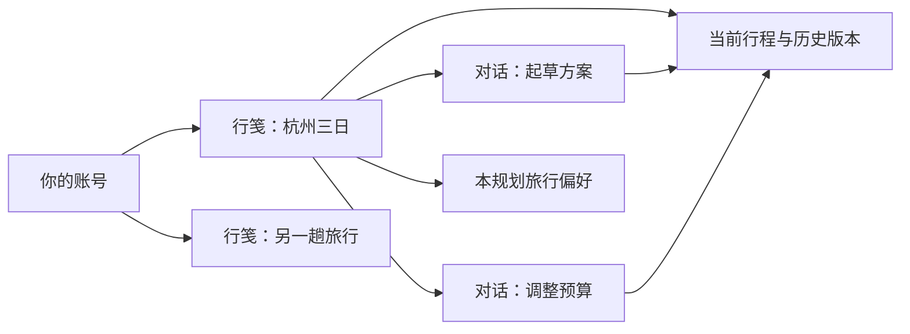
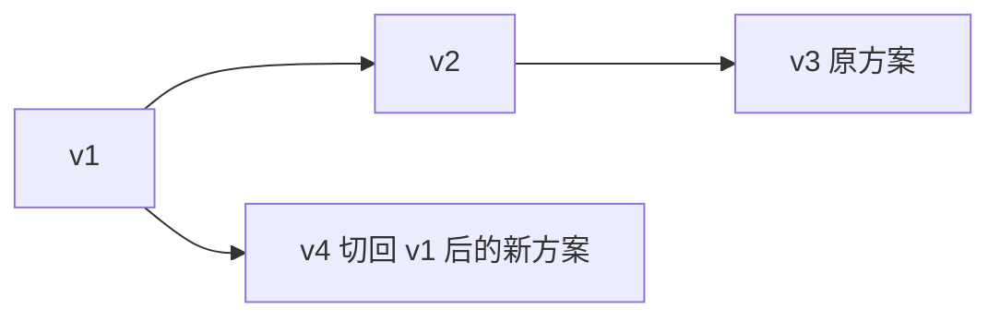

# 山海行笺使用手册

适用对象：普通用户、管理员及首次部署的开发者。编写日期：2026-09-16。依据：当前文件夹中的源码、界面组件与配置文件；不是对 GitHub 最新分支的在线验收。实际检查结果见 [本次检查记录](VERIFICATION.md)，开发原理见 [技术实现说明](TECHNICAL_GUIDE.md)。

## 1. 这个项目用来做什么

山海行笺是一款中文 AI 旅行规划工作台。你可以把目的地、天数、预算和偏好告诉 AI，让它把想法整理成按天安排的行程；再通过对话或表单调整地点、交通、住宿和用餐。行程还可以包含美食手账、出行清单，并保留历史版本，便于比较不同方案。

例如：先生成一份杭州三日游，再提出“第二天少走路”“把住宿预算降低”“增加预约清单”，查看修改后的版本，最后选择满意的一版。

| 你想做的事 | 对应功能 |
| --- | --- |
| 分别规划多次旅行 | 左侧「新建行笺」；一份行笺对应一份独立行程 |
| 针对同一次旅行继续讨论 | 行笺下新建或打开对话 |
| 用自然语言起草、调整行程 | 对话页，需管理员配置 AI 服务 |
| 自己填写行程与预算 | 行程总览、路线舆图里的表单，不依赖 AI |
| 记录想吃的菜与真实体验 | 风物食记 |
| 记录预约、打包等待办事项 | 行程总览中的出行清单 |
| 看地点分布或街景图片 | 路线舆图、沿途街景，需有效坐标和地图服务 |
| 恢复之前的行程方案 | 行笺留痕、版本路线 |

当前产品没有机票、酒店、门票下单或支付功能，也没有实时联网搜索、天气查询或道路导航。AI 给出的票价、营业时间等信息需要出行前另行核实。项目由多人合作开发，不代表产品已支持多人共同编辑同一份行笺；当前行笺属于各自账号，没有共享邀请界面。

## 2. 先理解三个概念

**行笺（工作区／规划）**：一次旅行的容器，包含一份当前行程、历史版本、若干对话和本次旅行偏好。

**对话**：属于某份行笺的聊天记录。同一行笺里的不同对话共用当前行程；换一个对话不会复制出另一份方案。要规划另一趟独立旅行，请新建行笺。

**版本**：已保存的结构化行程快照，编号如 v1、v2。切换版本会改变当前行程；之后编辑可以形成分支。版本不包含所有账号资料，具体范围见第 7 节。



## 3. 第一次使用：完成一份旅行计划

### 3.1 注册与登录

打开部署者提供的网址，本机开发默认是 [本机工作台](http://localhost:3000)。未登录时进入登录页。

1. 没有账号时切换到「注册」，填写邮箱、至少 6 位密码；「旅人称呼」选填。
2. 点击「注册，开启山海之旅」。已有账号选择「登录」。
3. 普通用户进入工作台；管理员登录后进入后台，可点击「返回工作台」。

当前页面没有自助找回密码、修改昵称或更换邮箱的操作入口。种子管理员账号由部署者设置，没有需要用户照抄的公开账号密码。

### 3.2 新建行笺

点击左侧「新建行笺」。系统创建一份「未命名行笺」，并创建关联对话。之后可由 AI 调整标题，或进入「行程总览 → 编辑资料」手工修改。

可以直接发送以下示例。它是用于演示操作的需求，不是已经核实的旅游攻略：

> 请在当前行笺里规划杭州三日游，2 位成人，2026 年 10 月 10 日开始。总预算 3000 元人民币，不含往返大交通。喜欢人文景观和小吃，不吃辣，每天最多 3 个景点，安排午休。请写清每天的交通、住宿建议和用餐，并加入出行清单。无法确认的票价和营业时间标注待核实；没有可靠坐标的地点请留空。

按 Enter 发送，Shift + Enter 换行。回复会逐步显示，AI 执行修改时可出现工具卡片和行程预览卡片。生成过程中可点击停止按钮。

如果显示“AI 尚未配置”，请联系部署者设置服务；仍可按第 5 节手工编辑。停止或生成失败不会自动撤销此前已经保存的修改，先检查当前行程和版本再决定是否重新发送。

### 3.3 检查结果并继续修改

点击行笺文件夹下的「行程总览」，查看天数、城市、预算与每天安排。需要调整时回到对话，例如：

> 保留第一天。第二天下午改成轻松的室内活动，不要连续走太久；把预算里的住宿总额改为 1000 元。

> 在出行清单中增加“出发前核实景区预约要求”。把推荐的小吃加入风物食记，状态设为“想尝尝”，不要写成我已经吃过。

每次提交后核对实际行程。仅出现一段建议文字不一定表示行程已修改；以行程总览、预览卡片及版本列表为准。

### 3.4 保存并再次打开

AI 工具成功修改时，服务器已经保存相应行程。聊天底部「保存行笺」保存的是服务器当前行程；内容没有变化时不会重复创建手工版本。表单里尚未提交的草稿，需要使用该表单的保存按钮。

刷新页面或在另一设备上登录同一个部署实例、同一个账号，可以读取已保存的行笺。未保存的输入草稿不属于可靠的持久化内容。聊天页面当前最多恢复最近 200 条消息，不能据此认为更早记录已被删除。

## 4. 认识界面与管理行笺

左栏是「我的行笺」文件夹列表，主区显示对话、行程内容或设置。窄屏下左栏折叠为抽屉，可从导航按钮展开。

| 入口 | 用法 |
| --- | --- |
| 新建行笺 | 开始一趟独立旅行，同时创建第一段对话 |
| 文件夹名称前的箭头 | 展开／收起该行笺 |
| 文件夹中的「行程总览」 | 进入五个行程页签 |
| 文件夹旁的加号 | 在同一行笺里新增对话，行程仍共用 |
| 放大镜 | 搜索行笺或对话；没有结果时可清除关键词 |
| 排序按钮 | 在按更新时间、按创建时间排序之间切换 |
| 底部头像和账号区域 | 打开账号及全局偏好设置 |
| 对话右侧删除按钮 | 删除该段对话及其消息；行笺本身仍保留 |
| 行笺右侧删除按钮 | 删除整份行笺及其版本、对话等关联数据 |

**删除整份行笺不属于版本回退操作，界面没有回收站。** 删除前确认选中的是目标行笺；同样，删除聊天记录也没有撤销入口。

对话标题会根据首次用户输入自动生成，当前没有手动重命名会话、复制会话到其他行笺或“另存为新行笺”的界面入口。

## 5. 手工编辑：五个页签

### 5.1 行程总览：基本信息、预算和清单

点击「编辑资料」，可修改行笺名称、旅程简介、封面图地址、行程标签、行前小记、预算及旅行手记。填写完点击「保存资料」，放弃本次修改可点「取消编辑」。

| 字段 | 填写方式 |
| --- | --- |
| 名称 | 必填，最多 200 字符 |
| 封面 | 可留空；填写 HTTPS 图片链接。当前没有本地图片上传入口 |
| 标签 | 使用逗号、中文逗号或顿号分隔 |
| 行前小记 | 每行一条提示 |
| 预算 | 总额与分类明细分别填写，金额不能小于 0；币种用 CNY 等三个大写字母 |
| 旅行手记 | 支持 Markdown，保存后显示在「沿途有记」区域 |

预算总额、预算明细、景点花费、美食花费是分别保存的值。系统不会自动保证它们相加一致，也不会换算汇率；调整花费后如需更新预算，应同步修改预算字段。

在「万事妥帖，再出发」清单中点击「添一项」，输入事项并点「添入清单」。点击事项可切换完成状态，也可删除。每次成功操作都会保存到行程，属于可回退内容；最多 100 项。

### 5.2 路线舆图：编辑每天安排与景点

此页同时承担地图查看和每日行程编辑。

1. 选择某一天；新增时点击「添一日」，空行程也可点「写下第一日」。
2. 通过「编辑日期 / 城市」打开已有日程表单，填写日期、城市、交通、住宿和用餐并保存。
3. 在当天「沿途清单」点击「添一处」，填写地点名称、类别、时间、地址、停留分钟数、花费和备注等。
4. 如有可靠位置，填写成对的 **BD-09 经度和纬度**；不确定时两项都留空。
5. 保存地点；用地点操作按钮编辑、调整相邻顺序或删除。

当前表单支持新增／编辑日程、增删改景点和景点上下移动；没有日程删除／日程移动按钮。这两种修改可在 AI 配置可用时通过对话提出。

没有坐标的地点仍能保存和显示在文字清单中，但不会绘制地图标记。填写地址不会自动转换成坐标。每份行程最多 90 天，每天最多 50 个地点，地图每页展示最多 10 个地点。

地图可以通过放大、缩小和地点聚焦按钮重新请求对应静态图，不能像完整地图应用一样自由拖动。连线表示当前页已定位地点的游览顺序；页面距离是部分相邻已定位地点的直线估算，不是道路里程，不能用于计算实际行车时间。存在未知坐标时，距离也可能不完整。

### 5.3 风物食记：收藏与记录美食

点击「记一道风味」，填写菜名／风味名称、餐厅、城市、地址、日期、餐次、状态、人均花费、评分、标签和笔记，然后点「保存这一味」。

- 「想尝尝」用于旅行前收藏；真正吃过后点「我尝过了」，也可移回想尝清单。
- 评分为 0～5 的整数，其中 0 表示暂不评分。
- 可按「全部风味／想尝尝／已尝过」筛选，也可搜索菜名、餐厅、城市或笔记。
- 最多 300 条；新增、编辑、状态切换和删除会保存行程版本。

这里的记录属于个人手账，没有餐厅实时信息、预订和公开点评发布功能。

### 5.4 沿途街景：查看地点环境图片

在「景点」下拉框中选位置。已有坐标且地图服务可用时显示街景图片；可调节视角和视野滑块。

没有坐标时，先去路线舆图编辑对应地点。无影像可能与坐标、服务配置或百度覆盖有关。此页是静态街景图片查看器，不是实时视频或可连续行走的全景导航。

滑块只调整当前查看角度，并不会单独生成一份行程版本。反复查看相同图片时系统会尝试使用缓存。

### 5.5 旅行偏好：让 AI 记住这次旅行的要求

选择「本规划」或「全局偏好」，填写内容后点「保存」。例如：

```markdown
# 我的旅行偏好
- 请称呼我为 {{nickname}}。
- 金额用 {{currency}} 标注。
- 每天最多安排 3 个主要地点，午饭后休息。
- 不吃辣，住宿优先交通方便的位置。
- 不确定的门票和开放时间写“出行前核实”。
```

优先级是：**有内容的本规划偏好 → 有内容的全局偏好 → 系统默认**。系统只选中其中一份，不会自动把本规划和全局内容合并。因此本次旅行也必须遵守的忌口等要求，应一起写在本规划偏好里。

清空本规划偏好并保存，可以退回使用全局偏好。限制是 4000 字符；「重载」会读取服务器当前保存的内容，丢弃未保存修改。界面上的 v 编号表示保存计数，当前没有偏好历史浏览和恢复功能。

界面里的“AGENTS.md”是存入数据库的旅行偏好名称，不要求普通用户在电脑上创建文件。它与仓库根目录给开发协作者看的 AGENTS.md 是两件事。偏好在后续 AI 请求时使用，保存偏好本身不会自动重写现有行程。

## 6. 如何判断是否保存成功

| 操作 | 保存行为 |
| --- | --- |
| AI 成功执行编辑工具 | 立即在服务器更新行程；一轮中可能陆续有多次修改 |
| 表单「保存资料／保存地点／保存这一味」等 | 成功后更新服务器；失败时查看提示，通常保留表单草稿 |
| 清单勾选、美食状态切换、地点移动 | 点击后提交保存请求，以成功提示为准 |
| 聊天底部「保存行笺」 | 保存当前行程；相同内容不重复创建手工版本 |
| 历史预览卡片「保存当前规划」 | 保存当前工作区的行程，不会把这张历史卡片恢复为当前版本 |
| 只输入文字，尚未提交 | 只是页面草稿，不能当作已备份内容 |

如果提示“规划已更新，请刷新后重试”，可能是另一标签页或 AI 已修改行程。先复制重要草稿，取消编辑并重新打开最新表单，再提交所需改动。不要连续使用同一份旧草稿尝试覆盖。

为减少冲突，使用期间尽量等 AI 本轮完成后再手工修改，尤其避免在多个标签页同时编辑同一行笺。当前并发保护仍有边界，详见技术说明。

## 7. 历史版本、比较与恢复

### 7.1 从哪里查看

- 「行程总览」底部的「行笺留痕」：展示近期最多 10 条版本，点击「切换到此版」。
- 对话区域的「版本路线」：展示版本分支，可缩放、平移并选择节点切换。
- 聊天预览卡片：「变更 N 处」查看字段差异，「复制 JSON」复制该版本完整行程。

聊天预览卡片中的「切换到此版本」也可用于恢复行程。首次检查发现的变量引用错误，已在后续 AI 工具问题修复时改正并通过类型检查；上述入口的浏览器操作仍需单独验收。记录见 [检查记录](VERIFICATION.md)。

版本列表接口当前最多返回 50 条，因此界面不是无限历史浏览器；更早版本可能仍在数据库中，但没有分页加载入口。预览卡片的差异展开最多显示 12 项，不能当作完整差异清单。

### 7.2 切换后发生什么

假设已有 v1 → v2 → v3，切回 v1 后再编辑，会新增 v4，v4 的父版本是 v1；v2、v3 仍保留。单纯切换不会新建版本，也不会删除后续历史。



AI 的原子编辑在同一轮、且该轮版本仍是当前版本时，会继续更新同一个版本，因此生成过程中不要把早期预览当作最终结果。兜底 patch 路径仍可能每次增加版本，不能保证所有 AI 对话都只产生一个版本。

### 7.3 哪些内容会一起回退

| 内容 | 切换行程版本的影响 |
| --- | --- |
| 标题、简介、封面、标签、预算、行前小记 | 回到目标版本的值 |
| 每日行程、地点、交通、住宿、用餐 | 回到目标版本的值 |
| 美食手账与出行清单 | 一起回退，包括状态和完成情况 |
| 「旅行手记」Markdown 正文 | 不回退，正文独立保存 |
| 全局／本规划偏好 | 不回退 |
| 对话记录 | 不回退；已关联对话时会追加版本操作说明 |
| 账号资料、图片缓存、删除整份行笺 | 不属于版本恢复范围 |

「复制 JSON」可把结构化行程粘贴到自己的文本文件中留存，但不包含完整聊天、偏好和独立 Markdown 正文。当前没有 PDF／Word 导出、JSON 文件导入或完整账号导出按钮；本站图片代理地址在其他部署中也未必能使用。

## 8. 管理员操作

管理员登录后进入 `/admin`，页面包含「概览／用户／规划／缓存」四个页签。

| 页签 | 可执行的操作与解释 |
| --- | --- |
| 概览 | 查看规划、会话、消息、缓存条目和缓存体积等数量 |
| 用户 | 查看账号和规划数量；设置／取消管理员、封禁／解封；服务端禁止修改自己的角色或封禁状态 |
| 规划 | 查看全站规划列表并删除指定规划；删除会级联影响其版本与对话 |
| 缓存 | 查看近期缓存记录并清空后端缓存；不会同步清空每个用户浏览器的 IndexedDB |

“历史街景存档”和“地图／街景缓存”统计的是数据库条目，不是准确的百度请求次数、命中率或账单金额。“外部地点搜索”未启用，数值固定为 0。

后台没有 AI 密钥或地图密钥编辑页面，配置需要维护者修改服务器环境变量。普通用户只能访问自己的规划；管理员拥有管理接口，不代表普通工作台变成多人共享空间。

## 9. 本机启动说明（部署者阅读）

### 9.1 本次目录与前置条件

本次项目位于 `E:\hbws\moji-xinglv-new\moji-xinglv-main`，`E:\hbws\package` 是 Bun 二进制分发包，不是第二个业务项目。项目内已有 `.env`、依赖目录和 `data/app.db`，首次安装步骤不能直接覆盖这些已有文件。

应用指定 Bun ≥ 1.4，本机检查到 1.4.2。使用 Bun 安装依赖和启动，不能直接以 Node 启动应用，因为数据库依赖 `bun:sqlite`。

### 9.2 安装依赖与配置

在 PowerShell 中执行：

```powershell
Set-Location 'E:\hbws\moji-xinglv-new\moji-xinglv-main'
bun --version
bun install --frozen-lockfile
if (-not (Test-Path -LiteralPath '.env')) {
    Copy-Item -LiteralPath '.env.example' -Destination '.env'
}
```

如果 `bun` 不在 PATH，本次文件夹提供了 `E:\hbws\package\bin\bun.exe`；可以用绝对路径调用它。测试框架还会从子进程寻找名为 `bun` 的命令，这与 PowerShell 能否执行 shim 不完全相同，排查方法和本次结果见检查记录。

用文本编辑器填写 `.env`，保存后重启服务以使用新配置：

| 变量 | 如何设置 |
| --- | --- |
| `AUTH_SECRET` | 设置自己的长随机会话密钥；生产至少 32 字符，不沿用示例值 |
| `BETTER_AUTH_URL` | 本机如 `http://localhost:3000`；部署后填写用户实际访问的服务地址 |
| `DATABASE_URL` | SQLite 路径，默认 `file:./data/app.db`；相对路径以启动工作目录为基准 |
| `SEED_ADMIN_EMAIL` / `SEED_ADMIN_PASSWORD` | 仅初始化管理员时使用，自行明确配置；生产密码至少 12 字符 |
| `AI_API_KEY` | AI 供应商密钥；留空时聊天返回未配置提示 |
| `AI_BASE_URL` / `AI_MODEL` | 与密钥配套的兼容接口地址与模型名；示例配置使用 DeepSeek 地址和 `deepseek-chat` |
| `BAIDU_MAP_AK` | 具有相应服务权限的百度服务端 AK；没有时无法新请求地图／街景，但可手工维护行程 |

模型还需要支持工具调用与流式响应。`AI_BASE_URL` 不要仅凭模型名猜测；当前代码在地址为空时走另一条供应商选择分支，建议按 `.env.example` 明确填写地址和模型。本次没有校验外部服务账户、余额或权限。

### 9.3 初始化与启动

仅在确认数据库目标正确、管理员配置已填写后执行：

```powershell
bun run db:migrate
bun run db:seed
bun dev
```

迁移建立或更新表结构。种子脚本创建管理员及其示例行程和默认偏好；示例不会自动出现在所有普通用户账号中。已有同邮箱用户时保留原密码，并把该账号设为管理员；**再次运行 seed 不是重置密码的方法**。当前示例标题包含“四日”，实际只填了两天数据，不宜据标题判断行程天数。

已有数据库时，本次编写文档没有运行迁移或 seed。进行升级前先做好数据备份，避免拿现有业务库运行会修改数据的演示脚本。

### 9.4 生产运行与备份

完成环境配置后，在项目目录执行：

```powershell
bun run build
bun .output/server/index.mjs
```

构建产物位于 `.output`。部署需要可运行 Bun 的服务器和可持久化、可写的 SQLite 数据目录；仅发布静态 HTML 不足以运行登录、聊天和保存功能。反向代理需要支持长时间流式响应，`/api/chat` 不宜缓存或缓冲整段回复。

使用新的服务器时也要带上数据库迁移所需文件，并先执行迁移。保持明确的工作目录或使用数据库绝对路径，防止因相对路径变化误建空库。停服后完整备份数据目录；数据库工作时可能存在 `app.db-wal`、`app.db-shm`，不要只复制一个正在写入的主文件便认定备份完整。图片缓存可以再生成，行程、版本、消息和账号是需要保留的核心数据。

## 10. 常见问题

| 现象 | 处理方式 |
| --- | --- |
| 看不到过去的行程 | 确认账号、访问地址及部署实例相同；检查搜索条件是否隐藏了结果 |
| 显示 401／要求登录 | 重新登录；开发者确认会话配置与访问域名一致 |
| 普通用户打不开后台 | 后台要求管理员角色，由部署者或现有管理员配置 |
| 聊天提示未配置／501 | 维护者设置 `AI_API_KEY`，并核对地址、模型；期间可手工编辑 |
| AI 服务不可用／502 | 维护者检查接口连通性、模型和凭据；先确认上一轮是否已保存部分修改 |
| 该规划正在生成／409 | 等该轮结束或停止后重新检查；不要重复开启并行生成 |
| 保存提示规划已更新／409 | 保留草稿，读取最新行程后重新应用所需修改 |
| 地点已有名称但地图为空 | 名称和地址不会自动定位；补齐 BD-09 经度、纬度 |
| 地图未配置／501，或街景不可用／502 | 联系维护者核对 AK 与权限；个别位置也可能没有影像 |
| 地图请求较多／429 | 稍后再试，减少连续调节参数的请求 |
| 清缓存后图片仍是原图 | 后端清理不会清理本地浏览器缓存；图片拍摄内容本身也可能未变化 |
| 复制 JSON 失败 | 检查剪贴板权限，并使用支持剪贴板的 HTTPS 或本机页面 |
| 工具提示参数校验失败 | 查看提示中的字段路径；让 AI 修正数组、餐次或清单字段，单纯重新读取不能修正错误参数 |
| 旧聊天仍显示通用工具失败 | 历史卡片保留原错误；更新代码并重启后发送新请求，新的失败会显示具体校验原因 |
| 点击历史卡片切换没有反应 | 确认已运行修正后的代码；也可使用行笺留痕或版本路线 |
| 用 Node 启动出现 `bun:` 协议错误 | 按项目脚本使用 Bun 运行 |
| `.env.example` 提到 `test:integration` 但命令不存在 | 当前 package.json 没有该脚本；不要把注释当成可执行命令 |

手册描述的是源码实现的操作流程。真实 AI、百度地图、移动端及浏览器端全流程还需按 [检查记录](VERIFICATION.md) 中的未验证项目另行验收。
